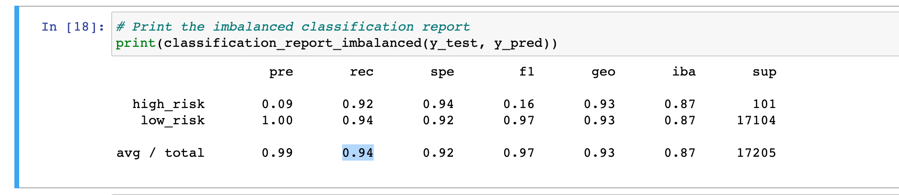

# Credit_Risk_Analysis

	## Overview

	We are working with a lending company that wants to use machine learning to predict credit risk. We will test some different models to see what one will most accurately identify good candidates for loans.

	## Results
	
	### Balanced Accuracy Scores

		- Naive Random Oversampling: 0.6550983384119515
		- SMOTE Oversampling: 0.662394124702461
		- Undersampling: 0.5442661782548694
		- Combination (Over and Under) Sampling: 0.6707402703553798
		- Ensemble, Balanced Random Forest Classifier: 0.7885466545953005
		- Easy Ensemble AdaBoost Classifier: 0.9316600714093861

	### Recall (sensitivity) average
		- Naive Random Oversampling:  0.61 
		- SMOTE Oversampling: 0.69 
		- Undersampling: 0.40 
		- Combination (Over and Under) Sampling: 0.58
		- Ensemble, Balanced Random Forest Classifier: 0.87 
		- Easy Ensemble AdaBoost Classifier: 0.94 (Image Below)

Analysis (24 points)

The written analysis has the following:

Overview of the loan prediction risk analysis:

The purpose of this analysis is well defined (4 pt)
Results:

There is a bulleted list that describes the balanced accuracy score and the precision and recall scores of all six machine learning models (15 pt)
Summary:

There is a summary of the results (2 pt)
There is a recommendation on which model to use, or there is no recommendation with a justification (3 pt)
