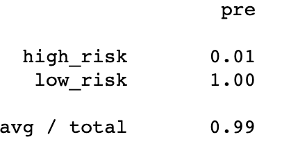

# Loan Prediction Risk Analysis

## Overview

We are working with a lending company that wants to use machine learning to predict credit risk. 
We will test different models to see what one will most accurately identify good candidates for loans.

## Results
	
### Balanced Accuracy Scores:

	- Naive Random Oversampling: 0.6550983384119515
	- SMOTE Oversampling: 0.662394124702461
	- Undersampling: 0.5442661782548694
	- Combination (Over and Under) Sampling: 0.6707402703553798
	- Ensemble, Balanced Random Forest Classifier: 0.7885466545953005
	- Easy Ensemble AdaBoost Classifier: 0.9316600714093861

### Recall (sensitivity) Average:
	- Naive Random Oversampling:  0.61 
	- SMOTE Oversampling: 0.69 
	- Undersampling: 0.40 
	- Combination (Over and Under) Sampling: 0.58
	- Ensemble, Balanced Random Forest Classifier: 0.87 
	- Easy Ensemble AdaBoost Classifier: 0.94 (Image Below)

### Precision:
	- Naive Random Oversampling:
		- High Risk: 0.01
		- Low Risk: 1.00
	- SMOTE Oversampling: 
		- High Risk: 0.01
		- Low Risk: 1.00
	- Undersampling:
		- High Risk: 0.01
		- Low Risk: 1.00
	- Combination (Over and Under) Sampling: 
		- High Risk: 0.01
		- Low Risk: 1.00 (Image Below)
	- Ensemble, Balanced Random Forest Classifier: 
		- High Risk: 0.03 
		- Low Risk: 1.00
	- Easy Ensemble AdaBoost Classifier:
		- High Risk: 0.09
		- Low Risk: 1.00

## Summary

The Ensemble models performed better than resampling models on accuracy, sensitivity and precision. The balanced accuracy score for the Easy Ensemble AdaBoost classifier was 0.93, much higher than the 0.67 score for the best of the resampling, Combination (Over and Under).

All models were much more accurate for predicting low risk than for high risk. While average precision is .99 for resampling models, the high-risk precision of .01 is actually very low, and the quantity of low-risk skews the results. Therefore, the average precision score is misleading.

Of these 6 models, Easy Ensemble performed the best, but .09 precision for high-risk is not good enough to recommend using this to make decisions.

